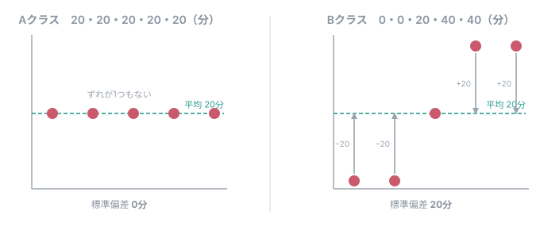
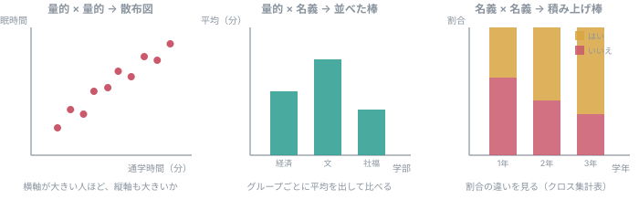

# 第4回 資料：代表値とばらつき、そして設問の組み合わせ

**問い：自分の調査票から、平均・ばらつき・分布は出せるか。**

---

## 1. 代表値を3つ

通学時間を5人に聞いて、**10分・20分・20分・30分・120分**だったとする。

| 名前 | 何を表すか | この例では |
|---|---|---|
| **平均** | 全部を足して人数で割る | **40分** |
| **中央値** | 小さい順に並べたときの、まん中 | **20分** |
| **最頻値** | いちばん多く出てきた値 | **20分** |

**平均40分と言われても、5人のうち4人は30分以内である。**
1人の120分が、平均を引き上げている。

**平均が悪いのではない。**平均は「全体をならすといくつか」を表す、ちゃんとした指標である。
**ただし、それだけでは多くの人の状況を言い表せないことがある。**

> **「小さい順に並べたときのまん中」を知りたいなら、中央値を見る。**
> **「いちばんありがちな値」を知りたいなら、最頻値を見る。**

だから、**平均を出すときは分布（ヒストグラム）も一緒に見る。**

!!! warning "最頻値は、いつでも使えるわけではない"
    上の例は **10・20・20・30・120** と、**きりのいい値**ばかりなので最頻値が出せた。

    ところが、**「あなたの睡眠時間は何時間ですか」と自由に書かせる**と、
    6.5・7・7.2・6・8.5 … と**ほぼ全員が違う値**になる。
    このとき最頻値は「**たまたま2人が同じだった値**」でしかなく、意味をなさない。

    **最頻値が役に立つのは、出てくる値の種類が限られているときである。**

    - **選択肢で聞いたとき**（名義・順序）── いちばん選ばれた選択肢が分かる
    - **「何時間」と整数で答えさせたとき** ── 同じ値が重なる

    **AIに「この設問から出せる集計は？」と聞くと、最頻値も挙げてくる。**
    AIは**データの種類**しか見ていないので、**実際にどんな値が集まるか**までは分からない。
    そこを判断できるのは、**設問を作った自分たち**だけである。

---

## 2. ばらつき ── 標準偏差

平均が同じでも、中身は違う。

- Aクラス：**20分・20分・20分・20分・20分** → 平均20分
- Bクラス：**0分・0分・20分・40分・40分** → 平均20分

**同じ平均なのに、ぜんぜん違う。**この「散らばりぐあい」を1つの数にしたものが**標準偏差**である。

**図の矢印が、一人ひとりの「平均からのずれ」**である。これを**偏差**という。

- **Aクラス**：全員が平均の上にのっている。**ずれが1つもない**ので、標準偏差は **0分**
- **Bクラス**：0分の人が −20、40分の人が +20。**ずれが大きい**ので、標準偏差は **20分**

### 標準偏差は、こうやって1つの数にしている

1. 一人ひとりの**偏差**（平均からのずれ）を出す
2. **2乗する。**そのままだと、＋のずれと−のずれが打ち消し合って 0 になってしまうため
3. 2乗したものを**平均する**（正確には「データ数−1」で割る）。これが**分散**
4. 分散の**平方根**をとると、元の単位（分）に戻る。これが**標準偏差**

式にすると、こうなる。

$$
\text{分散}\;s^2=\frac{(x_1-\bar{x})^2+(x_2-\bar{x})^2+\cdots+(x_n-\bar{x})^2}{n-1}
$$

$$
\text{標準偏差}\;s=\sqrt{s^2}
$$

| 記号 | 意味 |
|---|---|
| $x_1, x_2, \ldots, x_n$ | 一人ひとりの値（通学時間など） |
| $\bar{x}$ | 平均 |
| $n$ | データの数（人数） |
| $x_i-\bar{x}$ | **偏差**（上の図の矢印） |

**上のBクラスで、実際に追ってみる。**

| | 1人目 | 2人目 | 3人目 | 4人目 | 5人目 | |
|---|---|---|---|---|---|---|
| 値 | 0 | 0 | 20 | 40 | 40 | 平均 20 |
| **偏差** | −20 | −20 | 0 | +20 | +20 | 足すと **0**（だから2乗する） |
| **偏差の2乗** | 400 | 400 | 0 | 400 | 400 | 合計 **1600** |

$$
s^2=\frac{1600}{5-1}=400 \qquad s=\sqrt{400}=20\;(\text{分})
$$

!!! note "手で計算する必要はない"
    第6回で `df["通学時間分"].std()` と書けば、この計算がそのまま出る
    （`std()` も「データ数−1」で割る）。
    **大事なのは、「平均からどれくらい離れているのが普通か」を表した数**だということである。

!!! question "なぜ「データ数−1」で割るのか"
    **いまは気にしなくてよい。**手元の数人から、その外側の人たちのばらつきを見積もるときに、
    データ数で割ると**小さく出すぎる**ことが知られている。その補正である。

    「データ数で割る」流儀もあるが、**この授業とPythonは「データ数−1」でそろえる。**

- **標準偏差が小さい** ＝ みんな平均の近くにいる（Aクラス）
- **標準偏差が大きい** ＝ 平均から遠い人が多い（Bクラス）

**標準偏差は、量的データ（何分・何円・何回）にしか出せない。**
「所属学部」の標準偏差は意味がない。

!!! note "計算はPythonがやる"
    手で計算する必要はない。第6回で `df["通学時間分"].std()` と書けば出る。
    **いま大事なのは、「何を表す数なのか」を知っていることである。**

---

## 3. どの設問から、どれが出せるか

第3回で作った対応表に、**この回の視点を足す。**

| データの種類 | 平均 | 中央値 | 最頻値 | 標準偏差 | ヒストグラム |
|---|:---:|:---:|:---:|:---:|:---:|
| 名義（学部など） | ✗ | ✗ | ○ | ✗ | ✗（棒グラフ） |
| 順序（満足度1〜5） | △ | ○ | ○ | △ | ✗（棒グラフ） |
| 量的（何分・何円） | ○ | ○ | ○ | ○ | ○ |

**△は「等間隔とみなせば出せる」という意味である**（第3回で扱った）。
出すときは、**各選択肢の人数も一緒に見せる。**

**ここで自分の調査票を見直す。**

- **平均やヒストグラムを出したい設問が、選択肢で聞く形になっていないか**
- 逆に、**数値で聞いているが、実は分類でしかない設問はないか**（例：1＝経済、2＝文）

---

## 4. 🔴 この回の山：設問を組み合わせる

**第3回では、設問を1つずつ見て「この設問だけから何が出せるか」を書いた。**
**第4回では、「元の問いに答えるには、どの設問とどの設問を組み合わせるか」を決める。**

**これが「調査票の完成」の中身である。**

### 組み合わせると、こう見える

**どんな図になるのかを先に知っておくと、設問を選びやすい。**
上の3つは、第7回・第9回で実際に作る。

### 組み合わせの型

| 組み合わせ | 集計 | グラフ | 授業のどこで |
|---|---|---|---|
| 量的 × 量的 | 相関係数 | **散布図** | 第9回 |
| 量的 × 名義 | グループごとの平均・中央値 | 並べた棒 | 第7・9回 |
| 名義 × 名義 | **クロス集計表** | 積み上げ棒 | 第7回 |
| 順序 × 名義 | グループごとの分布 | 並べた棒 | 第7回 |

### 書き方の例

問いが「**通学時間が長い学生ほど、授業前夜の睡眠時間が短いか**」だとする。

> 問いに答えるため、**通学時間（Q1）と睡眠時間（Q2）を組み合わせる。**
> 横軸を通学時間、縦軸を睡眠時間にした**散布図**を作り、**両方に答えた人数**と**相関係数**を示す。
> 授業の開始時限によって違うかもしれないので、**Q3（何限か）ごとの睡眠時間**も見る。
> ただし、この調査だけでは、**通学時間を短くすれば睡眠時間が増える**という因果までは言えない。

**ここまで書けて、はじめて「調査票が完成した」ことになる。**

!!! warning "散布図を使うなら、量的な設問が2つ要る"
    第3回の条件は「量的データを最低1問」だった。
    **散布図で2つの関係を見るなら、量的な設問が2つ必要である。**
    いまの調査票で足りているか確かめること。

---

## 5. 統計量の名前を並べるだけにしない

対応表に「平均・中央値・標準偏差」と書けること自体は、採点の対象ではない。

**見るのは、「何を知るために、その集計をするのか」である。**

- すべての設問に平均を書く必要はない
- **その設問の種類と、調査の目的に合った集計**を選ぶ

---

## 課題4（5点）調査票の完成

**提出は2つに分かれる。**

### グループで1件（代表者がMoodleに記入）

- [ ] **完成した調査票の、回答者用URL**
- [ ] **設問の対応表**（第3回のものを更新する）
    - 設問番号・設問文・データの種類・**その設問だけから出せる集計**
    - **🔴 問いに答えるための「設問の組み合わせ」と、使うグラフ**（§4）
- [ ] **第3回から何を直したか**の記録
    - 直すところがなかった項目も、**何を確かめて変更不要と判断したか**を書く

**調査票そのものの確認**

- [ ] 設問文に**単位と記入例**がある（例：何分でしたか／90）
- [ ] 選択肢が**全部書かれている**。当てはまらない人の行き場がある
- [ ] **いつのことを聞いているか**がはっきりしている（例：直近7日間に）
- [ ] **自分で1件テスト回答**して、最後まで答えられることを確かめた
- [ ] **匿名で集める設定**になっていることを、テスト回答の結果で確かめた

### 各自で（グループの誰か1人では代えられない）

- [ ] **日本語のグラフが表示された画面**のスクリーンショット
- [ ] **renshu.csv を読み込めた画面**のスクリーンショット

**第6回からは各自のパソコンで動かす**ので、全員が確認する。
動かなかった人は、**エラーの内容と、誰に相談したか**を書いて出すこと。

!!! note "配点の目安"
    | 見るところ | 点 |
    |---|:---:|
    | 調査票の完成（設問・選択肢・期間・単位・テスト回答） | 2 |
    | 問いと分析計画が合っているか（設問の組み合わせ） | 2 |
    | 各自の環境確認 | 1 |

    **環境が動かなかったこと自体では減点しない。**相談した記録があればよい。
